# Book Libraru
#
## The Book Library web application allows you to register readers, issue books to them, and release books (after the reader returns the book back to the library). There is pagination for books, sorting books by year, book search page by title. There is also an automatic check to see if a person is overdue to return a book.
#
### There is a page with a list of all people, where you can add a new reader (people are clickable - clicking on them will take you to the person's page).
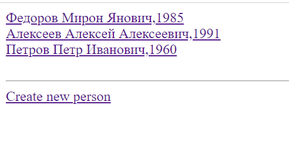
#
### A page with a list of all books (books are clickable - when you click on them you go to the book page).
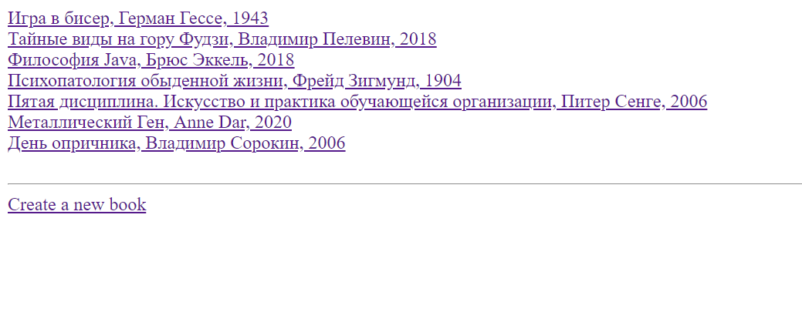
#
### A person's page, showing the values of their fields and a list of the books they have borrowed.
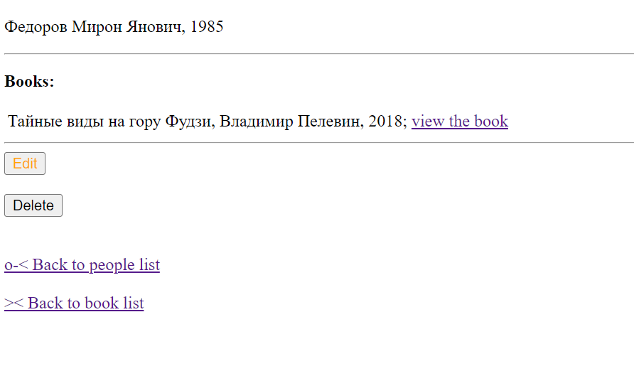
#
### *If a person hasn't picked up a single book:
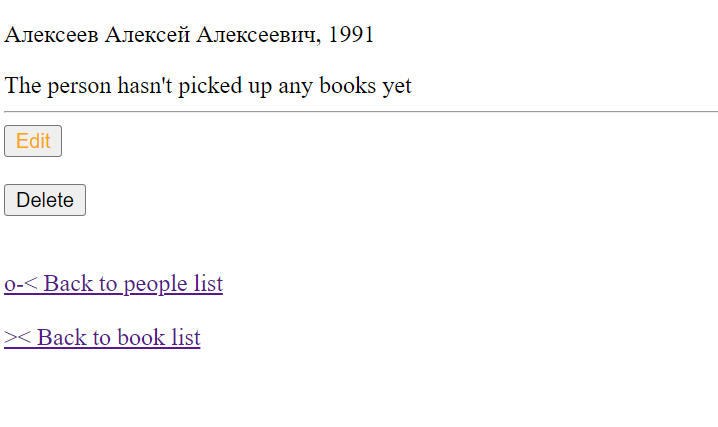
#
### A page of a book that shows the field values of that book and the name of the person, who picked up the book.
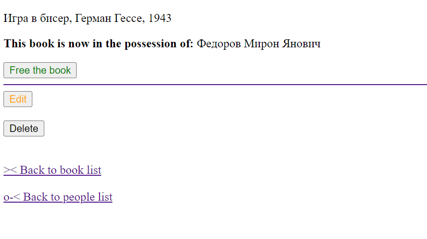
#
### *If this book hasn't been taken by anyone:
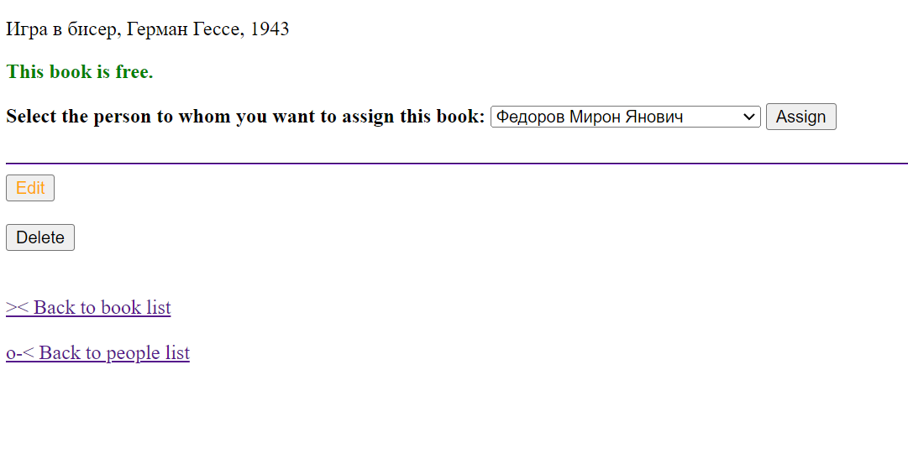
#
### The person edit page
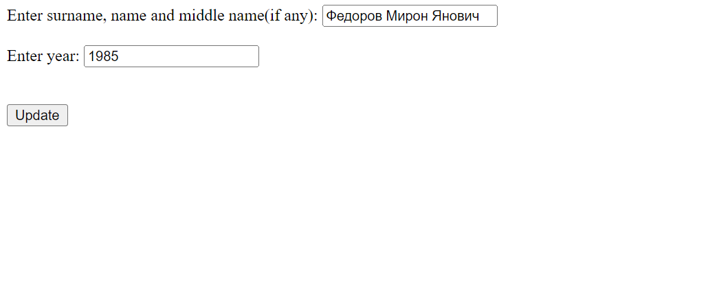
#
### Book edit page
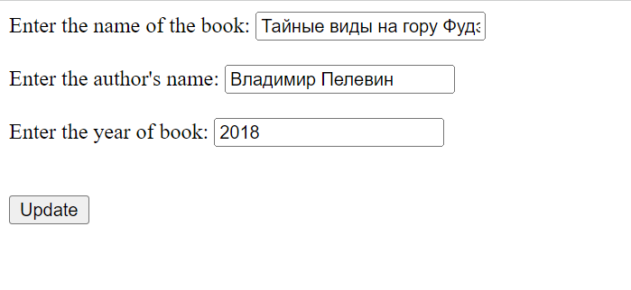
#
#
### The list of books can be paginated by specifying the number of pages and the number of books on one page
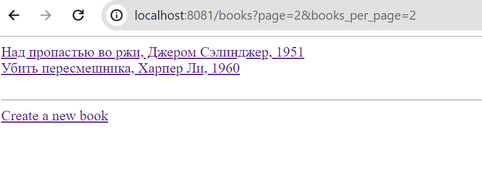
#
#
### It is possible to sort books by year
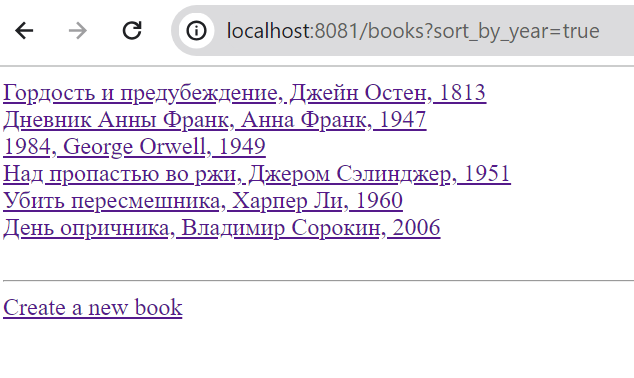
#
#
### Search for books by title or author (full or part)
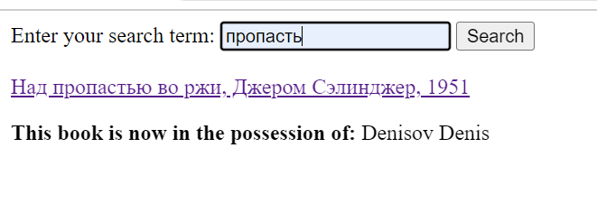
#
#
### An automatic check to see if a person is overdue for a book return. The book is highlighted in red
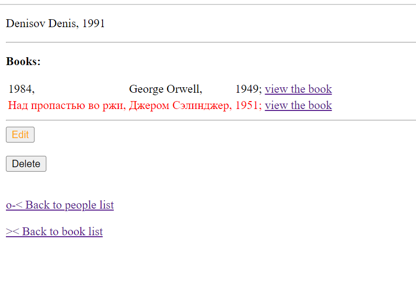
#
***Re-additions of a person with already existing data (full name and year of birth) are not allowed. 
The book can be taken by a person over 6 years of age. 
One book can only belong to one person. 
Entering the name of the author of the book is not obligatory.
The deadline for returning a book is 10 days.***

____
*Java 11.0.0.1
____
              
